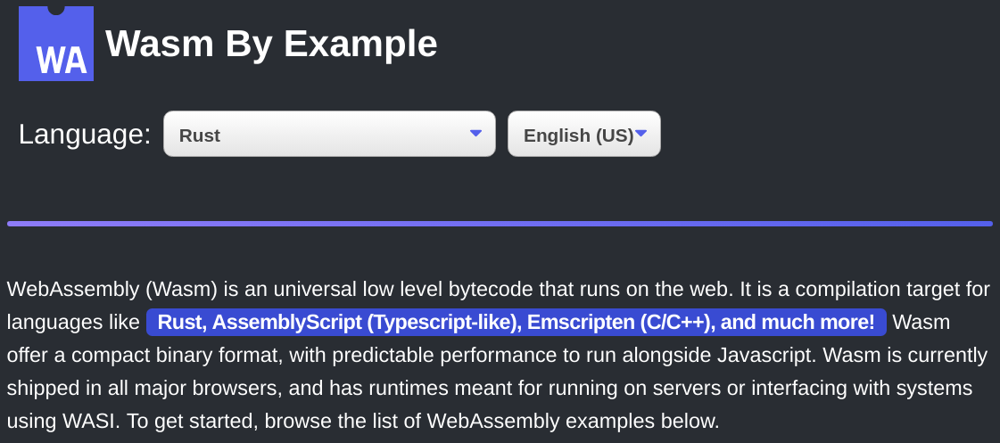

# wasm-by-example

A repo containing simple examples for how to get things done with wasm.

# Contributing

Thank you for wanting to contribute! Below is a guide for contributing different parts of the project:

## Examples

Examples are the individual examples, concepts, or ideas conveyed for each language. Examples are laid out in the following format:

`examples/EXAMPLE_NAME/EXAMPLE_NAME.PROGRAMMING_LANGUAGE.READING_LANGUAGE.md`

Where the variables represent the following ideas:

- `EXAMPLE_NAME` - is the name / title of the example.
- `PROGRAMMING_LANGUAGE` - is the programming language used for the code snippets (e.g Rust).
- `READING_LANGUAGE` - is the langauge that the idea is read / spoken (e.g English).

It is highly reccomended examples also offer a demo where reasonable. Demos should be placed:

`examples/EXAMPLE_NAME/demo/PROGRAMMING_LANGUAGE`

Please place all relevant files there, and feel free to serve via an iframe, or link to the full source code. It is also reccomended you offer a `README.md` to explain the demo, or simply offer build instructions.

Now that we understand how examples are made, let's see some general guidance for contributing examples:

### Creating a new Example

Awesome! Glad to see new examples and ideas! I'd reccomended opening an issue before contributing an entirely new example. This way we can discuss if the example idea is beneficial, and to bring awareness to other contributors that ma want to do any translations and things.

After the idea has been discussed, feel free to open a PR following the format explained above, and we can review and add it to the website!

By default, all new examples will be last in the example list on the homepage. To set the order of your example, add your example's name to the array in `build-system/example-order.js` to set its order.

### Adding a new Programming Language to an Example

If you are adding a new programming language, feel free to simply open a new PR with the format explained above, and we can review and add it to the website! **NOTE:** It is highly reccomended you add a demo of your example, unless there is a good reason for not providing one.

### Adding a new Reading Language (Translation) to an Example

If you are adding a new reading language, feel free to simply open a new PR with the format explained above, and we can review and add it to the website! New reading languages don't require a new demo or anything like that, and simply translate the written text between examples where it seems right.

## Improving the shell (the base website)

Improving the shell (E.g the language switcher or typos in the landing page and things), feel free to open a PR! For larger ideas or new sections of the site, it is reccomended to open an issue first for discussion.

## Any other contributions

For all other types of contributions (E.g perhaps you are a platform that wants to expand on Wasm By Example or something), please open an issue first describing the idea, and then we can work on a PR that works for the communitty at large.

# License

This work is copyright Aaron Turner and licensed under a [Creative Commons Attribution 4.0 License](https://creativecommons.org/licenses/by/4.0/).
